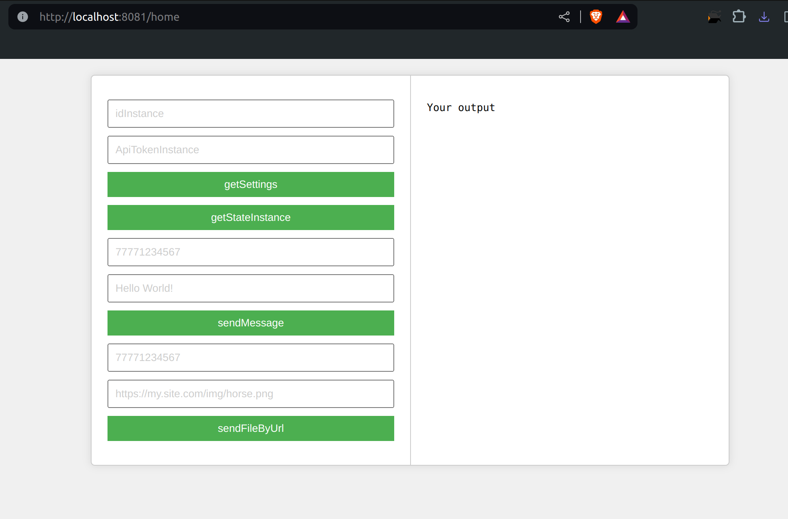
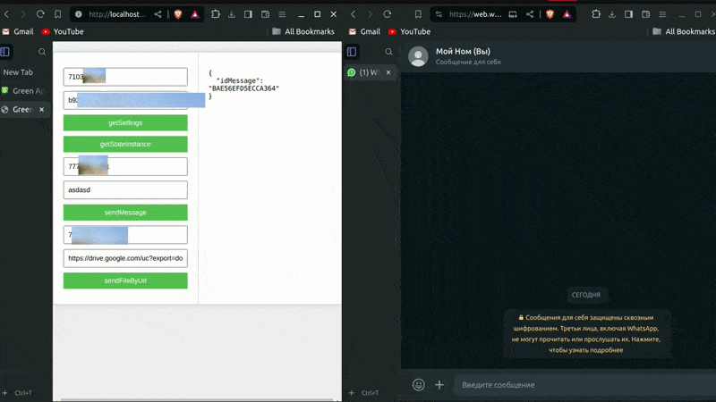

# Описание

Это тестовая [задача](https://drive.google.com/file/d/1RJ7aWvdfJeGhNdjFOqTUVNL55R2GeXeR/view?usp=drivesdk) из компании Green API

## Требования

1. Разработать HTML-страницу с вызовами методов GREEN-API:
   - `getSettings`
   - `getStateInstance`
   - `sendMessage`
   - `sendFileByUrl`
2. Разместить на странице параметры подключения к инстансу:
   - `idInstance`
   - `ApiTokenInstance`
3. Вывести ответ методов в отдельное поле на странице только для чтения.
4. Придерживаться макета (см. рисунок ниже).

## Алгоритм работы

1. Пользователь заходит в личный кабинет GREEN-API и создает новый инстанс на бесплатном аккаунте разработчика.
2. Пользователь сканирует QR-код и подключает свой номер телефона к инстансу.
3. Пользователь заходит на разработанную Вами страницу в Интернете и вводит параметры подключения к инстансу:
   - `idInstance`
   - `ApiTokenInstance`
4. Пользователь последовательно нажимает на кнопки «getSettings», «sendMessage» и видит результат работы – сообщения отправляются, ответ методов отображается на странице.

**Главная страница**


**Пример**

## Пререквезиты

- Go 1.19 или старше.

## Инструкция

1. **Сколируйте репозитории:**

    ```sh
    git clone https://github.com/Gontafi/green_api_task
    cd green_api_task
    ```
2. **Создать .env файл из примера .env.example(скопируйте api от своего личного кабинета)**


3. **Запустите проект:**

    ```sh
    go run main.go
    ```

4. **Зайдите в браузере по ссылке** 
- http://localhost:8081/home
